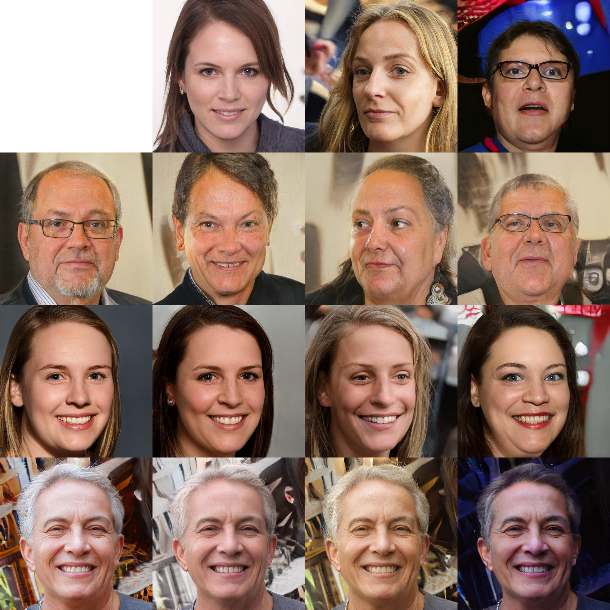

# StyleGAN Playground

MATLAB implementation of StyleGAN for inference using a pre-trained model.

Does not provide the ability to train models. But does allow you to play with the wealth of pre-trained models available. (See the [Awesome pretrained StyleGAN repository](https://github.com/justinpinkney/awesome-pretrained-stylegan))

## Examples

- [Slit scanning](examples/slitscan.md)