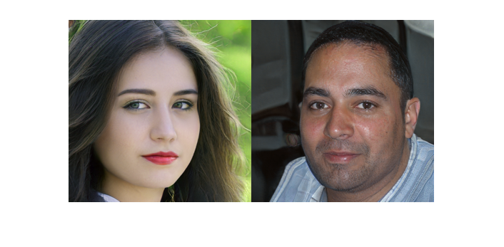
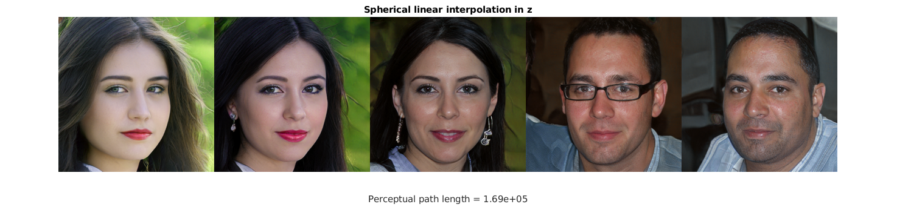
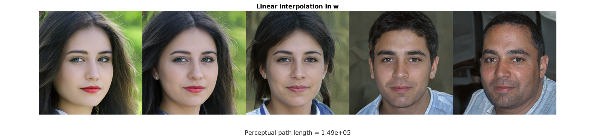

# Interpolation


StyleGAN lets us interpolate between faces. There are two latent spaces we can do interpolation in. First let's make two faces that we are going to interpolate between.


```matlab
seeds = [543, 32];

filename = fullfile(projectRoot(), "weights", "ffhq.mat");
generator = stylegan.Generator(filename);
generator.NoiseMethod = @stylegan.randnCached;

rng(seeds(1));
vec1 = randn(512, 1);
z1 = dlarray(single(reshape(vec1, 1, 1, [], 1)), 'SSCB');
rng(seeds(2));
vec2 = randn(512, 1);
z2 = dlarray(single(reshape(vec2, 1, 1, [], 1)), 'SSCB');

w1 = generator.mapping(z1);
w1 = generator.applyTruncation(w1);
w2 = generator.mapping(z2);
w2 = generator.applyTruncation(w2);

out1 = generator.image(generator.synthesis(w1));
out2 = generator.image(generator.synthesis(w2));
figure;
imshowpair(imresize(out1, 0.25), imresize(out2, 0.25), "montage");
```




First let's try linear interpolation in the z latent space.


```matlab
n = 5;
for iIm = 1:n
    alpha = (iIm - 1)./(n-1);
    z = (1-alpha)*z1 + alpha*z2;
    out{iIm} = generator.image(generator.generate(z));
end
plotResult(out, "Linear interpolation in z")
```


It's not a great interpolation: the person in the middle doesn't look like the average of the two, and where do those glasses come from?


Given this space is sampled from a high-dimensional Gaussian, spherical linear interpolation (slerp) is actually more appropriate. ("Most of a high-dimensional orange is skin", as the old saying goes)


```matlab
for iIm = 1:n
    alpha = (iIm - 1)./(n-1);
    z = slerp(alpha, vec1, vec2);
    z = dlarray(single(reshape(z, 1, 1, [], 1)), 'SSCB');
    out{iIm} = generator.image(generator.generate(z));
end
plotResult(out, "Spherical linear interpolation in z")
```




This is a little better, as shown the the perceptual path length, but we've still got random glasses appearing.


Finally we can interpolate in the w space, which is after the vector has been passed through the mapping network.


```matlab
for iIm = 1:n
    alpha = (iIm - 1)./(n-1);
    w = (1-alpha)*w1 + alpha*w2;
    out{iIm} = generator.image(generator.synthesis(w));
end
plotResult(out, "Linear interpolation in w")
```




This looks much better, seems like the mapped space is much more linear in terms of perception, as suggested by the paper.


```matlab
function pathLength = calculatePerceptualPathLength(out)
    epsilon = numel(out) - 1;
    f = cellfun(@(x) stylegan.extractVggFeatures(x, [0, 1]), out, 'UniformOutput', false);
    features = extractdata(cat(4, f{:}));
    differences = diff(features, 1, 4);
    pathLength = sum(sqrt(sum(differences.^2, [1, 2, 3])))/(epsilon.^2);
end

function plotResult(out, titleString)
    n = numel(out);
    montage(out, "Size", [1, n], "ThumbnailSize", [256, 256])
    pathLength = calculatePerceptualPathLength(out);
    title(titleString)
    xlabel(sprintf("Perceptual path length = %.2e\n", pathLength));
end
```
