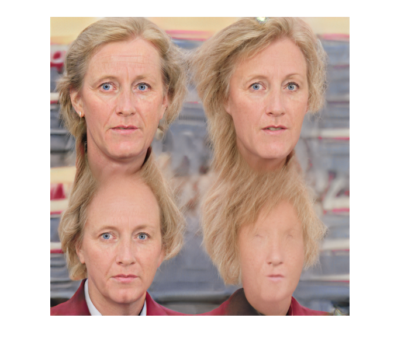

# Modifying the learned input


We can make larger resolution images from a given StyleGAN model by modifying the learned input. Normally it's 4x4, but if we make it 4x8 we will get an image that is twice as wide.


To do this we can pass a function handle to the Generator which will get called bfore/after every block in the StyleGAN model. In this case we will modify the current input activations if it is the first block (scale = 2).


```matlab
seed = 4;

filename = fullfile(projectRoot(), "weights", "ffhq.mat");
generator = stylegan.Generator(filename);
generator.PreBlockCallback = @modifyInput;
```


Once we've setup the generator with the callback function (which tiles four copies of the learned constant (see `modifyInput` below) we can run the model and will get a 2048x2048 size image. The more we monkey around with the learned input (by multiplying by some random numbers) the more weird the generated face gets.


```matlab
rng(seed);
z = dlarray(single(randn(1, 1, 512, 1)), 'SSCB');
w = generator.mapping(z);
w = generator.applyTruncation(w);

out = generator.image(generator.synthesis(w));
figure;
imshow(imresize(out, 0.25));
```



```matlab
function [x, w] = modifyInput(scale, x, w)
    if scale == 2
        x = cat(2, x, (1+2*randn(1,1,512)).*x);
        x = cat(1, x, (1+2*randn(1,1,512)).*x);
    end
end
```
