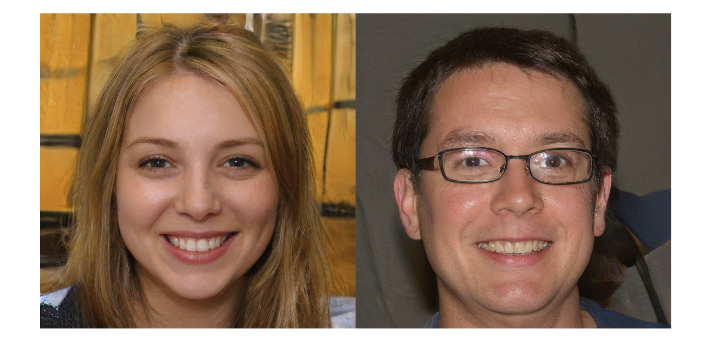
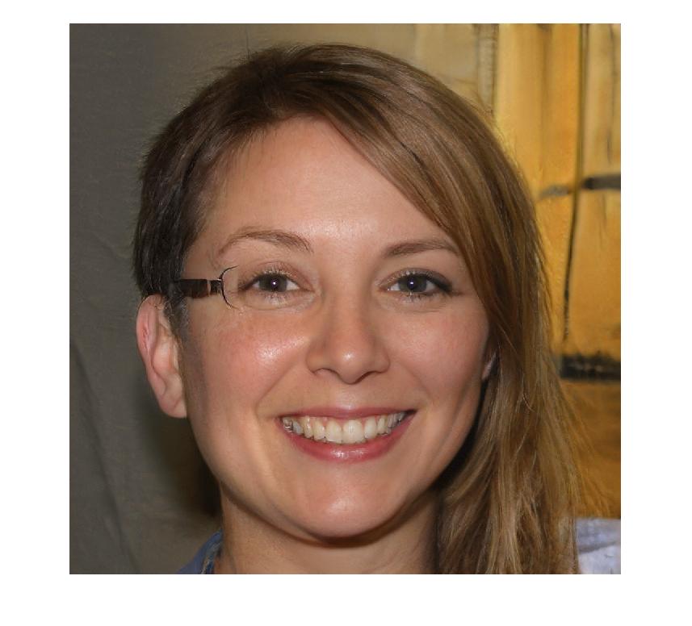

# Slit scanning


Because StyleGAN lets us nicely interpolate between two faces, we can simulate a slitscan camera and produce weird composite people.


First off generate some people to merge.


```matlab
seeds = [1, 2];

filename = fullfile(projectRoot(), "weights", "ffhq.mat");
generator = stylegan.Generator(filename);
generator.NoiseMethod = @stylegan.randnCached;

rng(seeds(1));
z1 = dlarray(single(randn(1, 1, 512, 1)), 'SSCB');
rng(seeds(2));
z2 = dlarray(single(randn(1, 1, 512, 1)), 'SSCB');

w1 = generator.mapping(z1);
w1 = generator.applyTruncation(w1);
w2 = generator.mapping(z2);
w2 = generator.applyTruncation(w2);

out1 = generator.image(generator.synthesis(w1));
out2 = generator.image(generator.synthesis(w2));
figure;
imshowpair(out1, out2, "montage");
```




Then make a slit scan using a linear interpolation between the two in w space.


```matlab
d = 4;
im = zeros(1024, 1024, 3, 'single');
startOffset = 128;
finishOffset = 128;
im(:, 1:startOffset, :) = out2(:, 1:startOffset, :);
im(:, end-finishOffset+1:end, :) = out1(:, end-finishOffset+1:end, :);
range = 1024 - startOffset - finishOffset;
n = range/d;

p = progress.Bar("Generating slit scan", n);

for i = 1:n
    alpha = (i-1)/(n-1);
    w = w1.*alpha + w2.*(1-alpha);
    outIm = generator.image(generator.synthesis(w));
    start = startOffset + (i-1)*d + 1;
    finish = startOffset + i*d;
    im(:, start:finish, :) = outIm(:, start:finish, :);
    p.update();
end
```
```
Generating slit scan |  | 100.0% | 00:00:00 | 00:11:44
```
```matlab
imshow(im)
```



